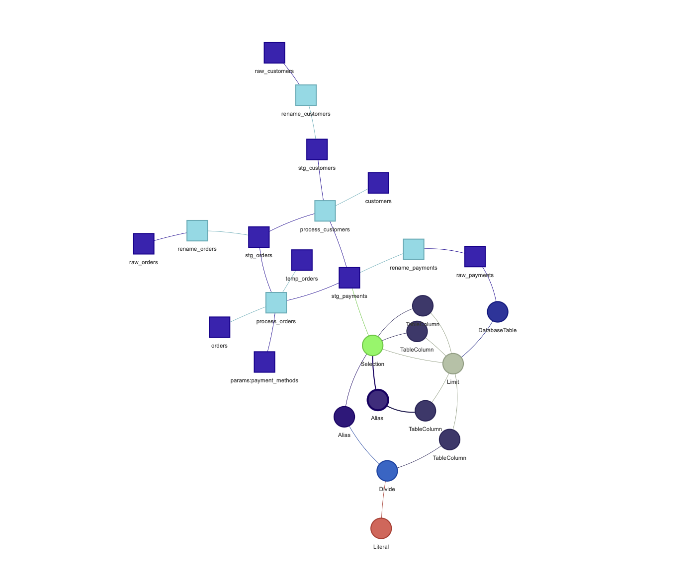
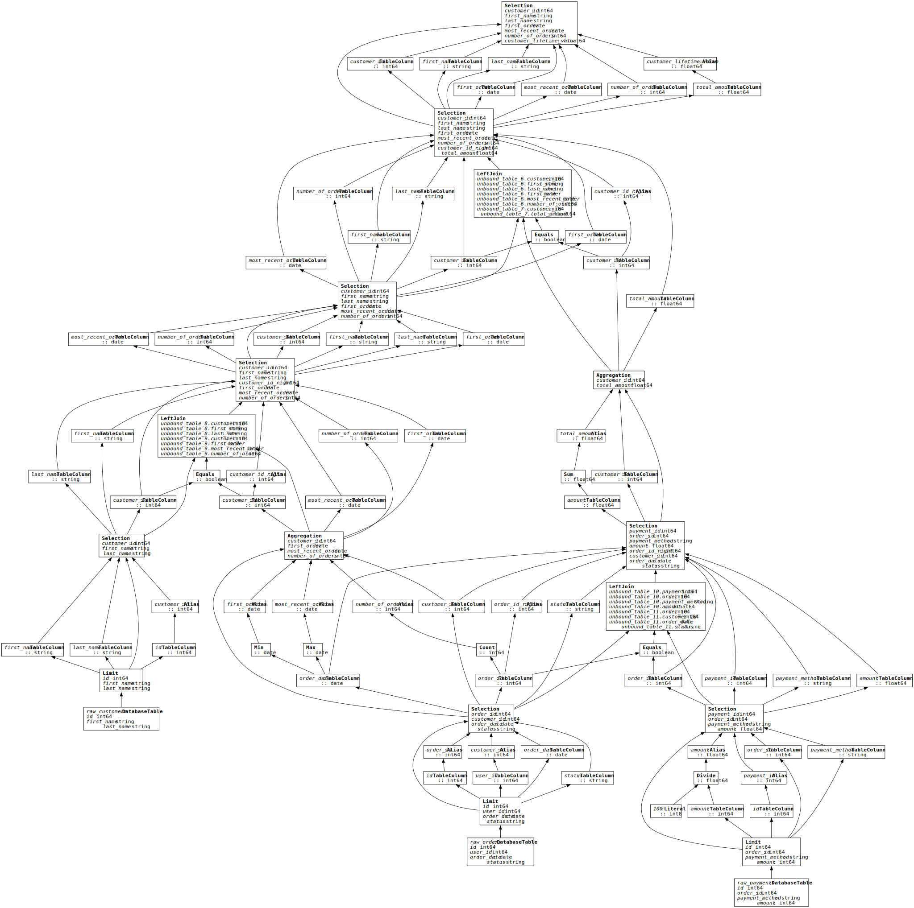

# Jaffle Shop

- Run `kedro run --pipeline seed`
- Open [notebooks/lineage_test.ipynb](notebooks/lineage_test.ipynb)

----

This project proves for an given Kedro node we can combine the Ibis query plan with the wider Kedro DAG

Ibis expressions can be natively visualised with the `op.visalize()` command

